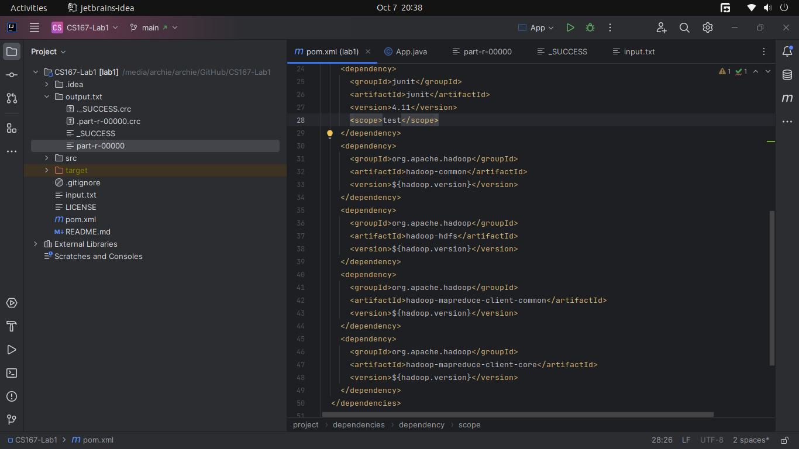
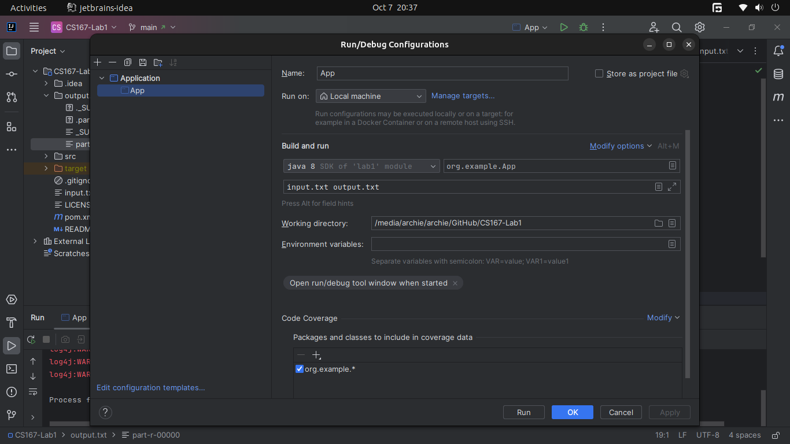
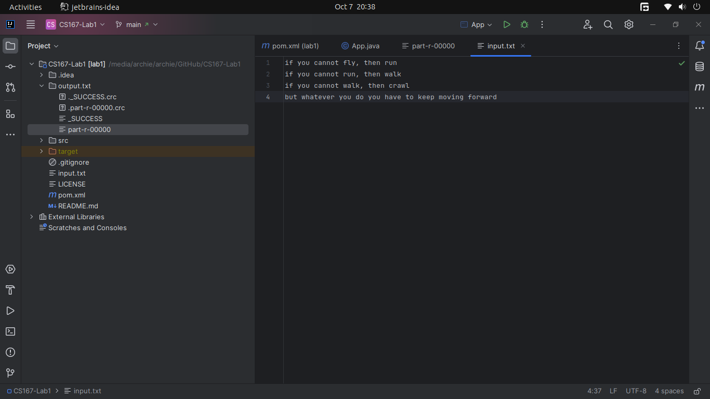

# CS167-Lab1
Getting started with big data with hadoop in Java

### pom.xml config


### main class


### run configuration


### input file


### compiling the app
```shell
    mvn package
   ```


### output
